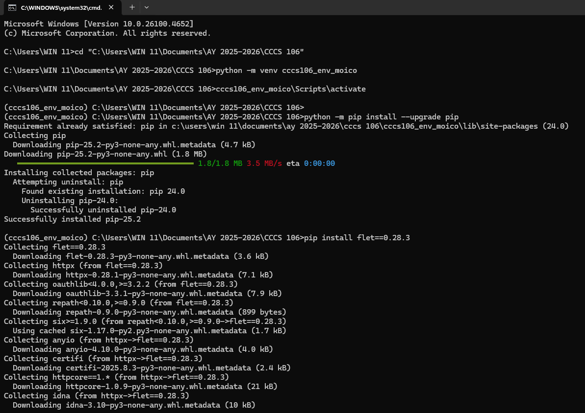
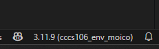
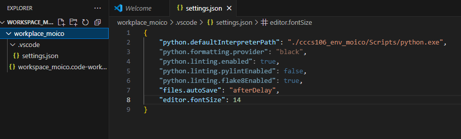
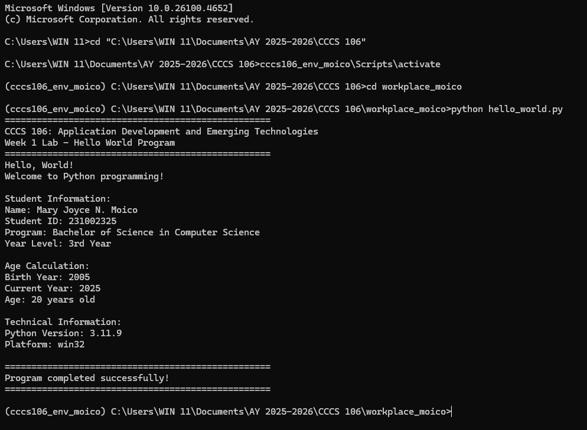
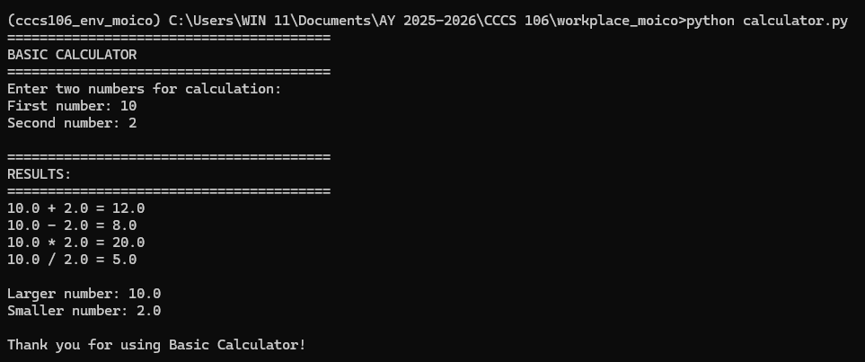
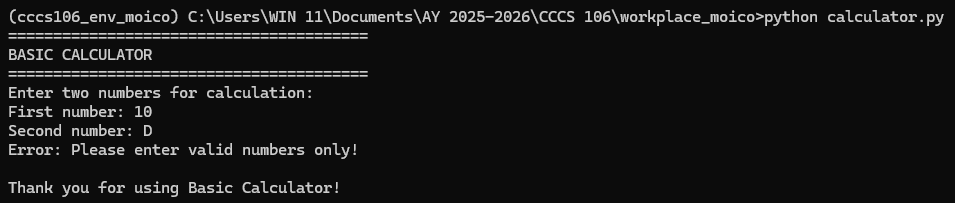
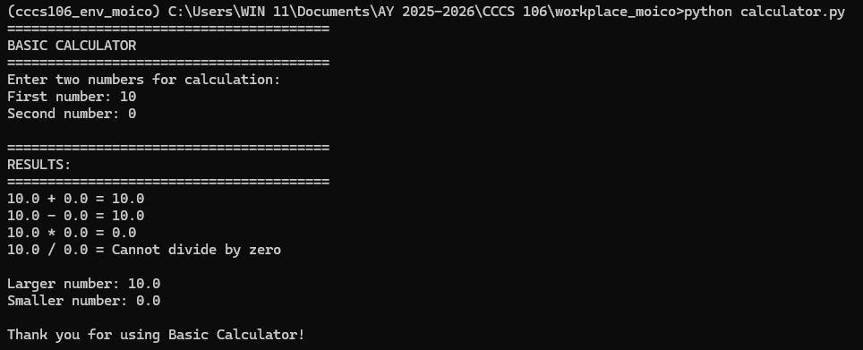

# Lab 1 Report: Environment Setup and Python Basics

**Student Name:** Mary Joyce N. Moico
**Student ID:** 231002325
**Section:** 3A
**Date:** 08-27-2025

## Environment Setup

### Python Installation
- **Python Version:** 3.11.9
- **Installation Issues:** No major issues.
- **Virtual Environment Created:** ✅ cccs106_env_moico

### VS Code Configuration
- **VS Code Version:** 1.103.2
- **Python Extension:** ✅ Installed and configured
- **Interpreter:** ✅ Set to cccs106_env_moico/Scripts/python.exe

### Package Installation
- **Flet Version:** 0.28.3
- **Other Packages:** none

## Programs Created

### 1. hello_world.py
- **Status:** ✅ Completed
- **Features:** Student info display, age calculation, system info
- **Notes:** none

### 2. basic_calculator.py
- **Status:** ✅ Completed
- **Features:** Basic arithmetic, error handling, min/max calculation
- **Notes:** Learned how to use try-except for errors

## Challenges and Solutions

I'm confused about where and how to create workplace and virtual environment, but I solved it by following the folder structure and organizing files using VS Code Explorer.

## Learning Outcomes

I learned how to install Python, set up a virtual environment, run programs from the terminal, and organize files in a project folder.

## Screenshots

## Environment Setup

## VS Code Setup

## Hello World Program

## Basic Calculator Program

